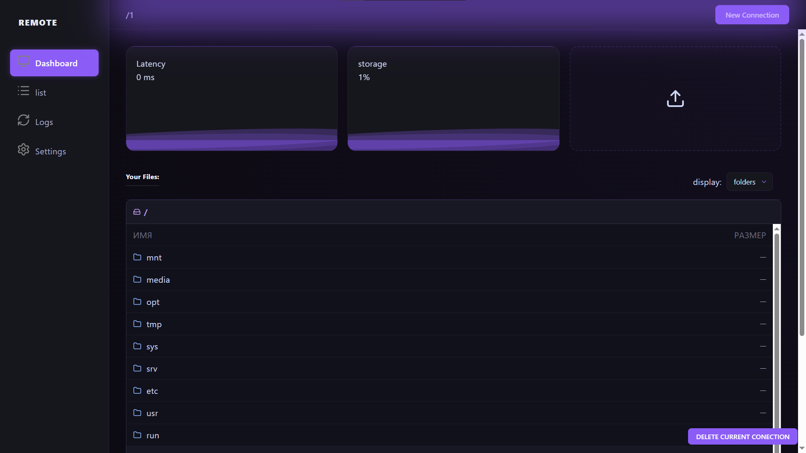
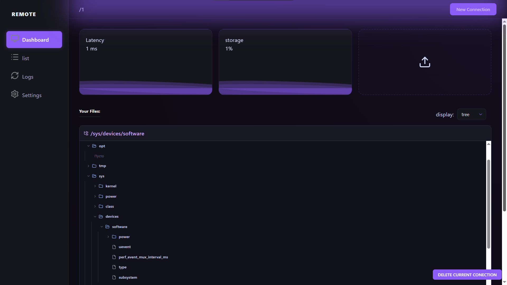
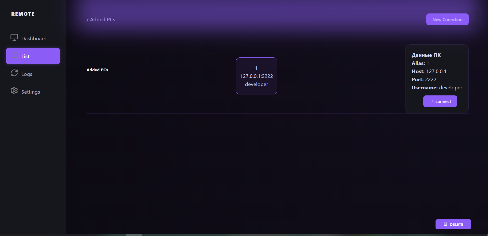
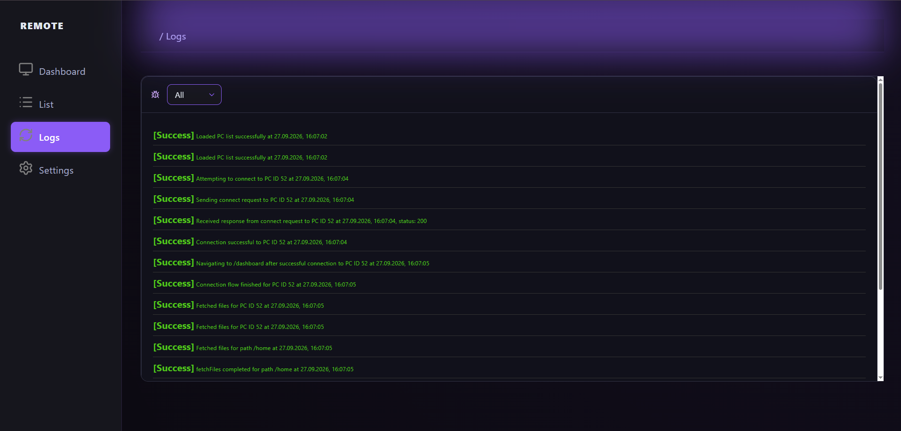
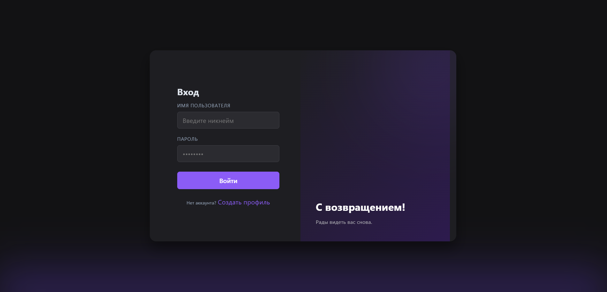
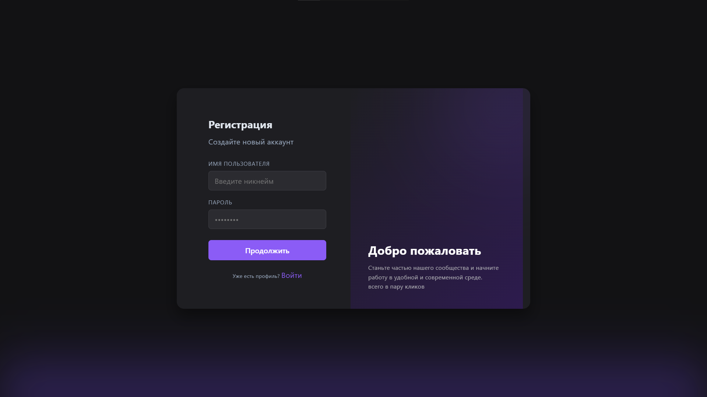
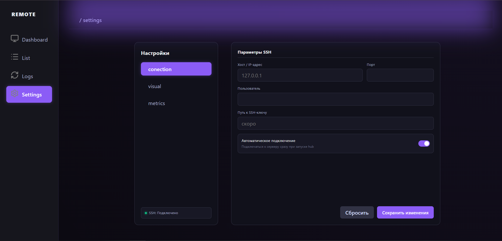
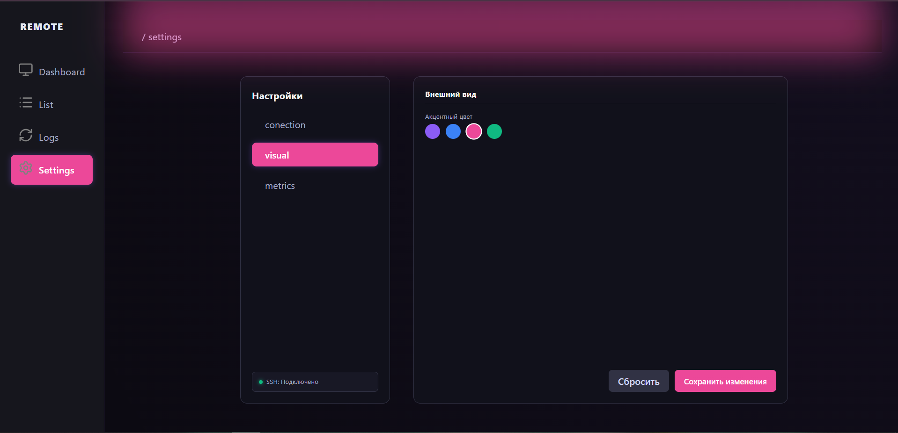
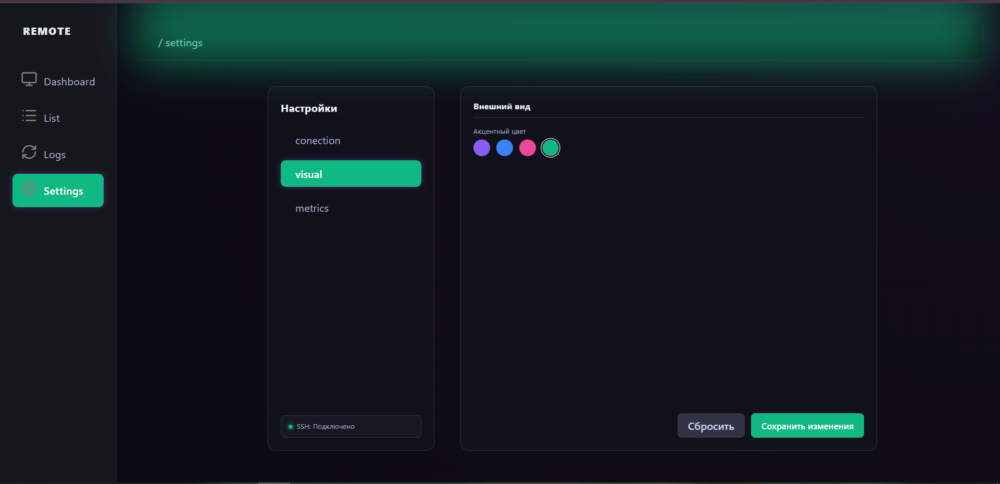
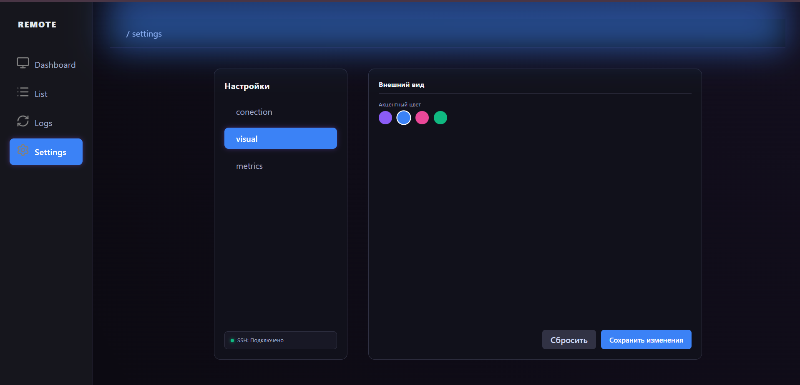

# 🖥️ Remote PC Hub

> **Remote PC Hub** — веб-приложение для дистанционного управления файловой системой, навигации и мониторинга удаленной машины в режиме реального времени через браузер.


---

## 🌟 Ключевой функционал

- 📂 **Управление файловой системой:** Навигация по директориям удаленного ПК, просмотр структуры папок, скачивание и загрузка файлов через веб-интерфейс.
- 🔐 **Защищенная авторизация:** Безопасный доступ к удаленному управлению с использованием JWT-токенов и Spring Security.
- ⚡ **Мгновенная реакция UI:** Оптимизированный клиентский стор на Zustand исключает лишние перерендеры и обеспечивает плавно работающий интерфейс.
- 🎭 **Анимированный UI/UX:** Интерактивный дизайн с модальными окнами и плавными переходами на базе Framer Motion.

---

## 👀 Обзор интерфейса

### Главная страница



### Главная страница c древовидными файлами



### Список  компьютеров



### Журнал событий



### вход



### Регистрация



### Настройки



### Варианты оформления настроек







---

## 🛠 Технологический стек

### Frontend
- **Core:** React 18, JavaScript (ES6+)
- **State Management:** Zustand
- **Animations & UI:** Framer Motion, CSS Modules
- **Routing:** React Router DOM (v6)

### Backend
- **Core Framework:** Java, Spring Boot
- **Security & Auth:** Spring Security, JWT (JSON Web Tokens)
- **Architecture:** REST API

---

## 🏗 Архитектура проекта


Проект разработан совместно [@R31tr0](https://github.com/R31tr0) (Frontend) и [@SaymonGrapes](https://github.com/SaymonGrapes) (Backend) и состоит из двух независимых сервисов:


```text
remote-pc-hub/
├── frontend/    # Клиентская часть (React 18 + Zustand + Framer Motion)
└── backend/     # Серверная часть (Java Spring Boot + Spring Security + JWT)


